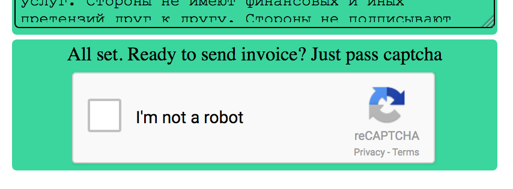
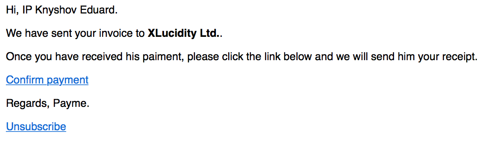
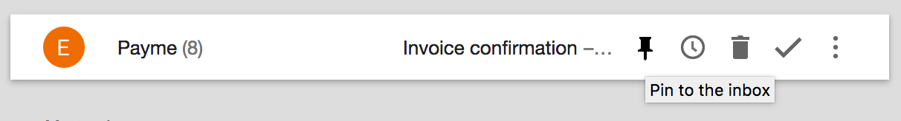
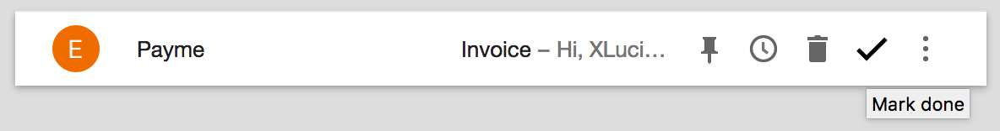
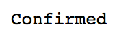
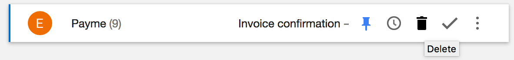
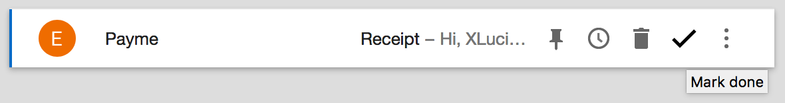

# Payme

Invoice your client in one click.

## Overview

Tired of your invoicing flow? Me too.
This service lets you invoice your client in one click.
Don\'t beleive me? [Count it!](http://payme.rust.cafe)

## Usage

The usage is very simple. My flow is as follows:

1. At the end of the month open [payme](http://payme.rust.cafe) and send an invoice to your client

2. You'll receive confirmation email with confirmation link

3. Pin confirmation until you received payment from client and archive invoice copy

4. Once payment is received, open confirmation email, click on confirm link and your client will receive a receipt

5. Archive receipt copy and remove confirmation email

6. Repeat. Payme will store your data in cookies for your convenince and in db until you clicked confirm link which removes all data related to your invoice
